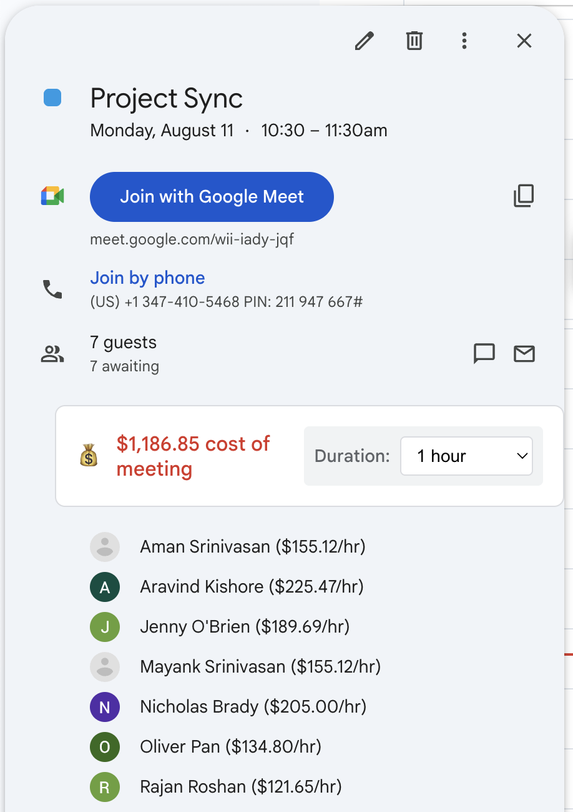
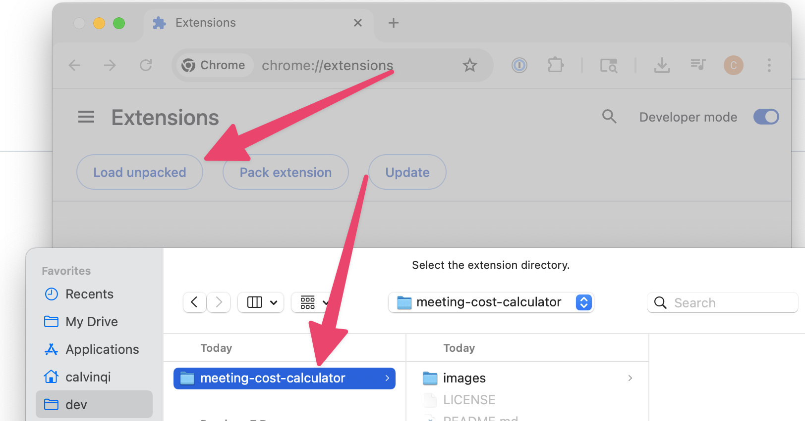
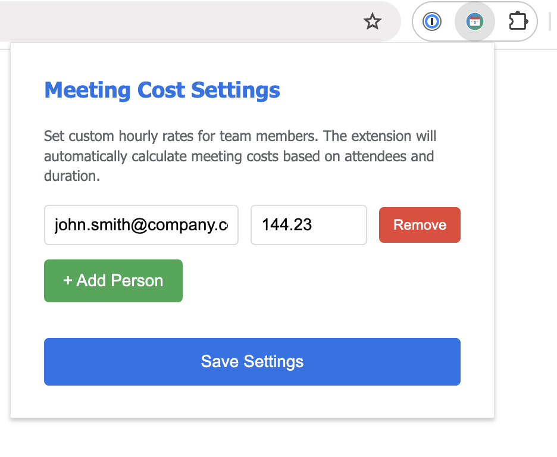

# Meeting Cost Calculator
Chrome extension that shows the cost of your Google Calendar meetings. Put an end to unnecessary syncs and reclaim your time!

## Installation Guide
1. Clone the repo with `git clone https://github.com/calvinqi/meeting-cost-calculator.git` with, or download the repo as Zip ([screenshot here](https://github.com/calvinqi/meeting-cost-calculator/blob/main/images/downloadzip.png) and unpack it.)
2. Navigate to [chrome://extensions](chrome://extensions) and make sure Developer Mode in the top right corner is enabled ([screenshot here](https://github.com/calvinqi/meeting-cost-calculator/blob/main/images/developermode.png))
3. Click **Load Unpacked** and select the folder

## Customizing Rates
The default pay rate is just set as this constant in `content.js`: `const DEFAULT_RATE = 150`, feel free to modify it.

For per-user customization, clicking the extension icon in the address bar opens up a form to set rates for specific email addresses.

### Credits
Much of this was vibe coded with the help of my dear friend Claude Code.

